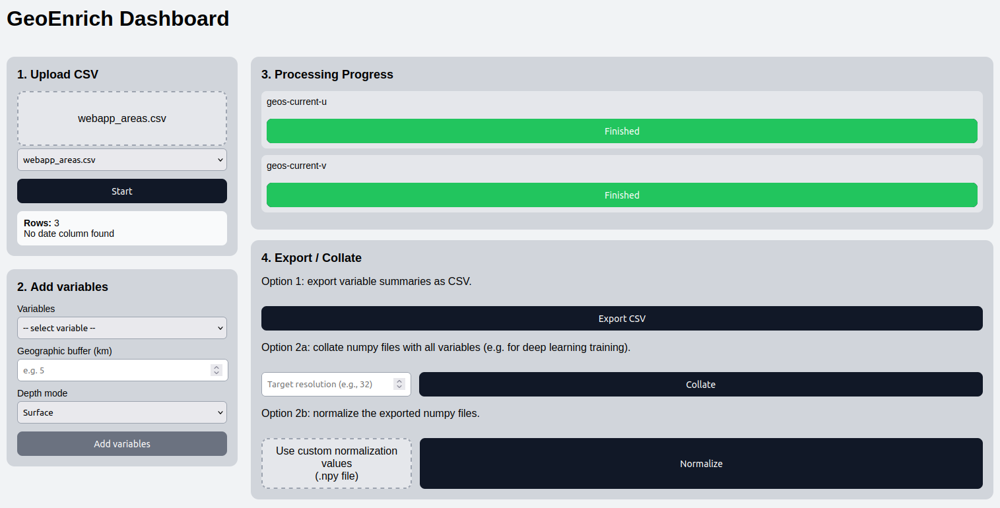

# Geoenrich Dashboard

The **Geoenrich Dashboard** web app may be useful to you if you want to download many variables on a large data set, as a way to track your progress.
This subfolder contains all needed files to run it in a web browser.

## Instructions

First clone the github repository:

```
git clone https://github.com/morand-g/geoenrich
cd geoenrich_dashboard
```

First open `docker-compose.yaml`, there are some adjustments to make:
- Indicate the path where you want to store data in the left part of lines 9 and 31.
- In that folder, you can put personal_catalog.csv ans .dodsrc files (see geoenrich documentation).
- If you're not using local netcdf data sets, remove line 32.


Then you can run `docker compose up --build` and access the app in your browser by typing `localhost:8081`.

